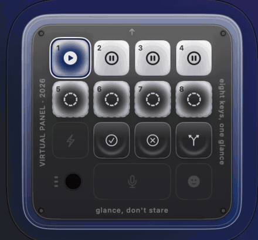

# Virtual Codex Micro

A floating macro pad for macOS that shows you what your Claude Code sessions are
doing, and lets you answer them without going to find them.

Eight keys, one colour each. Blue means thinking, amber means it is waiting on you,
green means done, red means it failed. The halo around the panel takes the colour of
the key you are watching, so the answer to "is anything waiting for me" is available
from across the room without reading anything.



It is an on-screen version of the OpenAI / Work Louder **Codex Micro** — same 4×4
face, same idea, no hardware. Where the physical pad has a dial and a direction pad,
this has eight agent keys, because eight sessions you can see beats four you can
scroll.

> **Status: works, for Claude Code, on one machine.** It has been used against real
> sessions daily. It has not been used by anyone but its author, there is no test
> target (see [Checks](#checks)), and Codex support is designed but not built. Treat
> the version number as absent rather than 1.0.

## What it actually does

**Shows state.** Every bound key carries the live state of one Claude Code session.
Four sources feed it and they disagree constantly, so states are arbitrated rather
than latest-wins — see [How state is decided](#how-state-is-decided).

**Answers permission prompts.** When a session asks to run something, its key turns
amber; the ✓ and ✕ keys approve or reject it. This works for sessions running under
cmux, which exposes a socket API for sending keys to a specific surface. For sessions
in a plain terminal it does not — see [What it cannot do](#what-it-cannot-do).

**Brings a session forward.** Click a key and the app hosting that session comes to
the front. This is not a list of supported terminals — the resolver walks the
process's ancestry until it finds the owning `.app`, so a session running in a
JetBrains IDE terminal, VS Code, or anything else works without knowing about it.

How precisely it lands depends on the host. A cmux session is focused through cmux's
own socket API (`rpc surface.focus`), which addresses an exact surface. Everything
else goes through process-ancestry resolution, in three tiers:

| | Hosts | Result |
|---|---|---|
| **Tier 1** | Terminal, iTerm2 | the exact window *and* tab |
| **Tier 2** | GoLand, VS Code, Zed, cmux.app, everything else | the app comes forward, but **not a specific tab** |
| **Tier 3** | detached tmux | nothing to raise; you get an offer to attach |

Tier 1 is short because it holds only hosts whose tty→window scripting was actually
tested. An untested emulator is classified Tier 2 rather than assumed: raising the
wrong tab confidently is worse than admitting the limit, since the point of clicking a
key is to be told where the session is.

The panel says which it did — `Raises GoLand — cannot target the tab` — rather than
reporting a generic success.

**Notices sessions on its own.** A session started before the app, started as a bare
`claude` with no flags, or opened after launch all get picked up and bound to a free
key without being told.

## Requirements

- macOS 14 or later. Developed on macOS 26.5.
- Swift 6 toolchain. Command Line Tools is enough — Xcode is **not** required and the
  project is deliberately buildable without it.
- **cmux**, optional. Without it you get colour and focus; with it you also get
  approve and reject.

## Install

**[Download the latest DMG](https://github.com/GuitarWag/virtual-codex-micro/releases/latest)**
— universal (Apple Silicon + Intel), 3.5 MB. Or build it yourself with
`./Scripts/package.sh`.

**Ad-hoc signed means macOS will refuse to open it.** `spctl --assess` on the
result reports `rejected`, and that is the correct verdict — the app carries no
Developer ID, so the system cannot tell you who wrote it. On macOS 15 and later,
right-click → Open no longer bypasses this. The one route is:

1. Open the DMG, drag the app to Applications, launch it once and let it be blocked.
2. **System Settings → Privacy & Security**, scroll to the message about
   VirtualCodexMicro, click **Open Anyway**.
3. Grant Accessibility and Automation when asked — clicking a key raises another
   app's window, and macOS will not allow that silently.

That is a genuine security warning and not a formality. What you can check for
yourself before dismissing it:

- **No network code.** No `URLSession`, no sockets, nothing outbound. Session state,
  transcripts and the activity log never leave the machine.
- **It spawns exactly four external binaries**: `/bin/ps` (find sessions), `/bin/sh`
  (the hook forwarder), `/usr/bin/osascript` (raise a window) and `/usr/bin/tmux`.
- **It reads** `~/.claude/projects/*.jsonl` (your transcripts, locally) and **writes**
  `~/.claude/settings.json` only when you explicitly install hooks, backing it up
  first.

Fixing the warning properly needs a Developer ID Application certificate and a paid
Apple Developer account; `notarytool` itself is already present in Command Line
Tools. Until then, building from source below avoids the whole issue.

## Build and run

```sh
swift build
./Scripts/bundle.sh          # produces .build/VirtualCodexMicro.app
open ./.build/VirtualCodexMicro.app
```

For a release build, tell the bundler too — it defaults to `debug` and will not go
looking:

```sh
swift build -c release && ./Scripts/bundle.sh release
```

`bundle.sh` exists because a bare executable has no stable identity for macOS
privacy permissions, so a signed bundle is required before the system will remember a
granted permission. It ad-hoc signs, which is enough locally.

The app has no Dock icon or main window (`LSUIElement`). It lives in the menu bar.

| Action | How |
|---|---|
| Show / hide the panel | `⌃⌥⌘V`, or the menu bar icon |
| Keep it on top | `⌃⌥⌘P` |
| Lost the panel off-screen | menu bar → **Bring Panel to Main Screen** |
| Which key is which | menu bar → **Keys & Presets** |
| What just happened and why | menu bar → **Activity** |
| Permissions and hook install | menu bar → **Setup & Permissions** |

### Permission prompts need hooks installed

Amber — "this session is blocked on you" — is the one state nothing can infer from
the outside. It comes from Claude Code's `PermissionRequest` hook, which fires in
about a millisecond. Without hooks installed, every other colour still works and
amber never appears.

Inspect what would be written, then apply it:

```sh
VCM_HOOKPLAN=1  ./.build/debug/VirtualCodexMicro   # print the plan, change nothing
VCM_HOOKAPPLY=install ./.build/debug/VirtualCodexMicro
VCM_HOOKAPPLY=uninstall ./.build/debug/VirtualCodexMicro
```

Two separate flags on purpose: the only path that edits `~/.claude/settings.json`
has to be asked for explicitly, never as a side effect of looking. The install backs
up the existing settings first and adds a forwarder script under
`~/.virtual-codex-micro/`.

## How state is decided

Four sources report on the same sessions and routinely contradict each other. None is
sufficient alone:

| Source | Contributes | Blind to |
|---|---|---|
| **cmux events** | state changes, surface identity, approve/reject | sessions not under cmux |
| **Claude hooks** | `needsInput` (nothing else can), real pids | sessions started before install |
| **Transcript tailing** | cold start — sessions that existed before the app | `needsInput`; cannot separate idle from exited |
| **Manual** (`/v-micro-connect`) | a forced colour for testing, expires in 45s | everything real |

`StateEngine` arbitrates on **confidence** first, then evidence time:

```
inferred  <  reported  <  forced
```

`forced` sits on top only because it expires; a manual colour that live sources could
overwrite is useless exactly where you want it. A source may only report states in
its declared vocabulary — the transcript tailer is structurally forbidden from
claiming `needsInput`, so it can take amber *down* but never light it.

Liveness is one function (`LivenessMap`) with four inputs: argv, hook-learned
`CLAUDE_PID`, pids the registry persisted, and a working-directory join for a bare
`claude` whose argv names nothing. Remembered pids are re-checked with `kill(pid, 0)`
rather than trusted. This was four separate definitions once and it produced a key
that read "no live session" about a process that was running fine.

### Seeing why a key is the colour it is

The app writes `~/Library/Application Support/VirtualCodexMicro/status.tsv` on every
change: per key, the resolved state, the source that won, its confidence, and what the
halo is following.

```
key 2	hydra	idle	inferred	claude.transcript reported idle
key 3	codex-micro	running	reported	claude.hooks reported running
RING	following key 3	running	-	-
```

This is the most useful thing in the repo. Every bug worth finding was found by
reading it — a colour you cannot explain is indistinguishable from a colour that is
wrong.

## Connecting a session by hand

Discovery has holes: a bare `claude` names no session id, a brand-new cmux session
has no resume checkpoint yet, an idle session emits nothing. A session always knows
its own identity, so it can say so:

```
/v-micro-connect          # take the first free key
/v-micro-connect 3        # take key 3
/v-micro-connect green    # force a colour, for testing — reverts after 45s
```

The skill lives in `~/.claude/skills/v-micro-connect/`. A forced colour proves the
panel renders and the halo follows; it proves nothing about whether a real integration
works.

## What it cannot do

**Approve or reject in a plain terminal.** Focus works there; typing does not. A
session the app did not spawn must not be typed into — there is no way to know the
keystroke lands in the prompt you think it does rather than in a half-typed command.
Keys that cannot act are drawn disabled instead of failing silently. cmux is the
exception because its socket API addresses a specific surface.

**Start sessions.** Nothing spawns agents. `OwnedSession` implements a full PTY
child that would allow it, and has no call sites.

**Tell apart two bare `claude` sessions in one directory.** They are
indistinguishable from outside, so both abstain rather than one being guessed at.

**Codex.** The backend protocol was built for two providers and only one exists.

**Be installed without a Gatekeeper warning.** The DMG is ad-hoc signed, not
notarised — see [Install](#install).

### Known fault

In the dark appearance the `needsInput` halo carries no amber. Measured against a
constant background, the running halo shifts blue and the error halo shifts red, but
`needsInput` lifts all three channels almost evenly and lands faintly *cool*. Both
its face and its halo were pushed to near-white to clear the contrast ladder, so
nothing on a dark panel is actually amber. It is still separable by brightness and
halo width, which is why the separation checks pass. Light mode is unaffected.

## Checks

There is no test target. Command Line Tools ships neither XCTest nor swift-testing,
so `swift test` cannot run here at all. Checks are compiled into the binary instead:

```sh
./Scripts/verify.sh          # builds first, then runs everything — use this
```

`verify.sh` exists because I twice ran checks against a stale binary and reported a
pass. It refuses to check anything it did not just build.

- **`SelfCheck`** — 30 module suites of pure invariants, instant.
  `VCM_SELFTEST=1 ./.build/debug/VirtualCodexMicro`
- **`PixelCheck`** — renders each state and measures contrast from the **rendered
  pixels**, not from the colour model. Added after the model and the rasteriser
  disagreed and the model was believed.
- **`check-render.sh`** — compares light and dark renders against committed
  references. `--update` to rebaseline.

```sh
VCM_PROBE=1 ./.build/debug/VirtualCodexMicro   # what discovery can currently see
```

The probe calls the same functions the app does. An earlier version reimplemented
them, disagreed with the app, and sent me looking in the wrong half of the program.

## Layout

```
Sources/VirtualCodexMicro/
  Panel/      NSPanel host, SwiftUI views, the coordinator that wires it together
  Backends/   cmux adapter, Claude hooks, transcript tailer, hook installer
  State/      arbitration, slot bindings, liveness, drift handling
  Support/    layout maths, colour palettes, shared types
docs/
  demo/       the clips above
spikes/       five feasibility spikes, each with a FINDINGS.md
PLAN.md       feasibility verdict and milestones
CHANGELOG.md  what shipped, release to release
```

`spikes/` is kept deliberately. Several load-bearing decisions rest on measurements
taken there — that `PermissionRequest` fires in ~1ms while `Notification` is debounced
by 6s, that `turn_duration` is the only reliable turn boundary, that `forkpty` works
where `openpty` plus `Process` does not.

## Design notes

**Colour is not the only channel.** Every state has a text label and a distinct
glyph, and filled versus hollow marks carry state independently of hue. Red and green
are deliberately held at different luminance — same-luminance red and green is the
textbook deuteranopia failure, and "done" versus "failed" is the most expensive
confusion this panel can cause.

**The panel never claims to know something it does not.** A session whose state
cannot be established shows `unknown` with a reason, never `idle`. "Finished and
waiting" and "not there any more" are different facts, and from disk alone they are
indistinguishable.

**Being wrong quietly is the failure mode to avoid.** A pad that is confidently
mistaken about which session is which is worse than no pad, because you would approve
a diff you never read.
